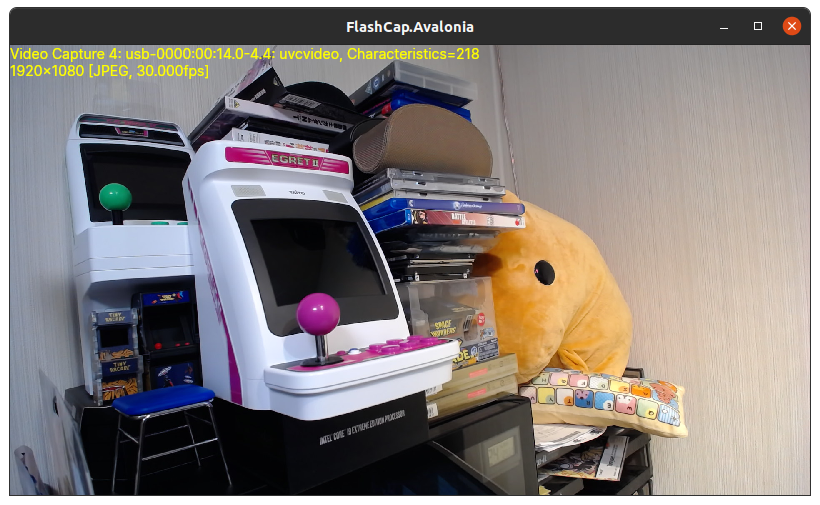

# FlashCap


FlashCap - シンプルで依存性のない、カメラキャプチャライブラリ

[](https://www.repostatus.org/#wip)

## NuGet

| Package  | NuGet                                                                                                                |
|:---------|:---------------------------------------------------------------------------------------------------------------------|
| FlashCap | [](https://www.nuget.org/packages/FlashCap) |

## CI

| main                                                                                                                                                                 | develop                                                                                                                                                                       |
|:---------------------------------------------------------------------------------------------------------------------------------------------------------------------|:------------------------------------------------------------------------------------------------------------------------------------------------------------------------------|
| [](https://github.com/kekyo/FlashCap/actions?query=branch%3Amain) | [](https://github.com/kekyo/FlashCap/actions?query=branch%3Adevelop) |

---

[English language is here](https://github.com/kekyo/FlashCap)

## これは何?

.NETでカメラキャプチャ機能を実装する必要がありますか？
.NETでのカメラキャプチャライブラリに困っていますか？

このライブラリは、カメラのキャプチャ機能のみに特化したカメラ画像取り込みライブラリです。
シンプルなAPIで使いやすく、簡素なアーキテクチャで、ネイティブライブラリを含んでいません。
また、他のライブラリに依存することもありません。
[NuGetの概要ページをご覧ください](https://www.nuget.org/packages/FlashCap)

対応する.NETプラットフォームは以下の通りです（ほぼ全てです！）:

* .NET 6, 5 (`net6.0`, `net5.0`)
* .NET Core 3.1, 3.0, 2.2, 2.1, 2.0 (`netcoreapp3.1` and etc)
* .NET Standard 2.1, 2.0, 1.3 (`netstandard2.1` and etc)
* .NET Framework 4.8, 4.6.1, 4.5, 4.0, 3.5, 2.0 (`net48` and etc)

カメラデバイスが使用できるプラットフォーム:

* Windows (DirectShowデバイス)
* Windows (Video for Windowsデバイス)
* Linux (V4L2デバイス)

---

## 使い方

最初に、対象デバイスと映像の特性を列挙します:

```csharp
using FlashCap;

// キャプチャデバイスを列挙します
var devices = new CaptureDevices();

foreach (var descriptor in devices.EnumerateDescriptors())
{
    // "Logicool Webcam C930e: DirectShow device, Characteristics=34"
    // "Default: VideoForWindows default, Characteristics=1"
    Console.WriteLine(descriptor);

    foreach (var characteristics in descriptor.Characteristics)
    {
        // "1920x1080 [JPEG, 30fps]"
        // "640x480 [YUYV, 60fps]"
        Console.WriteLine(characteristics);
    }
}
```

次に、キャプチャーを実行します:

```csharp
// 映像特性を指定して、デバイスを開きます:
var descriptor0 = devices.EnumerateDescriptors().ElementAt(0);

using var device = descriptor0.Open(
    descriptor0.Characteristics[0])

// ピクセルバッファを予約します:
var buffer = new PixelBuffer();

// フレーム到着イベントをフックします:
device.FrameArrived += (s, e) =>
{
    // ピクセルバッファにフレームをキャプチャします:
    device.Capture(e, buffer);

    // 画像データのバイナリを取得します:
    byte[] image = buffer.ExtractImage();

    // 画像データを何かに使う...
    var ms = new MemoryStream(image);
    var bitmap = Bitmap.FromStream(ms);

    // ...
};

// 処理を開始:
device.Start();

// ...

// 処理を停止:
device.Stop();
```

完全なサンプルコードはこちらです:

* [Windowsフォームアプリケーション](samples/FlashCap.WindowsForms/)
* [Avaloniaアプリケーション](samples/FlashCap.Avalonia/)

TODO:

* [WPFアプリケーション](samples/FlashCap.WPF/)

Avaloniaのサンプルコードは、単一のコードで、WindowsとLinuxの両方で動作します。
ユーザーモードプロセスでリアルタイムにキャプチャを行い、
（MJPEGから）ビットマップをデコードし、ウィンドウにレンダリングします。
AvaloniaはSkiaを使ったレンダラーを使用しています。かなり高速です。




---

## FrameArrivedイベントについて

`FrameArrived`イベントは、画像データをキャプチャできる状態になったときに発生します。

* このイベントはワーカスレッドで呼ばれることがあり、
  ユーザーインターフェースに画像を反映させようとすると問題が発生することがあります。
* ワーカースレッドで処理を実行しても問題ない場合でも、
  スレッドが長時間占有されるとフレーム落ちが発生します。

この状況を回避するためには、以下のような複雑な処理を実装する必要があります:

```csharp
// FrameArrivedイベントが処理中であるかどうかを示す値。
private int isin;

// ...

// フレームが到着した:
device.FrameArrived += (s, e) =>
{
    // キャプチャが実行されていない場合:
    if (Interlocked.Increment(ref this.isin) == 1)
    {
        try
        {
            // キャプチャを行う:
            device.Capture(e, buffer);
            // 非同期でユーザーインターフェースに反映させる:
            this.BeginInvoke(() =>
            {
                try
                {
                    // ビットマップにデコードする:
                    var bitmap = Image.FromStream(
                        new MemoryStream(buffer.ExtractImage()));
                    BackgroundImage = bitmap;
                }
                finally
                {
                    // 完了した。
                    Interlocked.Decrement(ref this.isin);
                }
            });
        }
        catch
        {
            // 例外で中止した:
            Interlocked.Decrement(ref this.isin);
            throw;
        }
    }
    else
    {
        // すでに実行中:
        Interlocked.Decrement(ref this.isin);
    }
}
````

このように、問題を回避するために安全に書くのは骨が折れます。

しかし、FlashCapは、より簡単に実装するために、
このアルゴリズムをカプセル化した `LimitedExecutor` クラスを定義しています:

```csharp
// LimitedExecutorを用意する:
private readonly LimitedExecutor limitedExecutor = new();

// ...

// フレームが到着した:
device.FrameArrived += (s, e) =>
    // LimitedExecutorを使用して、処理を1つだけ実行するように制限する
    this.limitedExecutor.Execute(
        // JustNowセクション: キャプチャを実行する
        () => device.Capture(e, buffer);
        // Offloadedセクション(非同期で実行):
        () => this.Invoke(() =>
        {
            // ビットマップにデコードする:
            var bitmap = Image.FromStream(
                new MemoryStream(buffer.ExtractImage()));
            // ユーザーインターフェースに反映させる:
            this.BackgroundImage = bitmap;
        }));
````

`JustNow` と `Offloaded` の両セクションは、何も実行されていない時にのみ実行されます。
`JustNow` では、`device.Capture()` が呼び出されてフレームがキャプチャされます。
`Offloaded` セクションは、`FrameArrived`イベントのスレッドとは
別のワーカースレッドで実行されます。

`Offloaded` セクションが完了すると、実行状態が解放されます。
つまり、この間は `FrameArrived` イベントは無視され続けます。

---

## ピクセルバッファをマスターする (Advanced topic)

ピクセルバッファ（`PixelBuffer`クラス）は、
画像データの割り当てとバッファリングを制御します。
PixelBuffer` のインスタンスを使い分けることで、
1フレーム分の画像データを効率的に処理することができます。

例えば、次々と入ってくるフレームをキャプチャ（`ICaptureDevice.Capture`メソッド）して
別々のピクセルバッファにキューイングし、
取り出し操作（`PixelBuffer.ExtractImage`メソッド）は別のスレッドで実行することができます。

この方式は、フレーム到着イベントの実行コストを最小化し、フレームドロップを回避することができます。

もう一つ、関連する重要な機能があります。
`ExtractImage` を呼び出すと、イメージングデバイスで使用されている固有の画像フォーマットから
`RGB DIB` フォーマットに自動的にトランスコードされるのです。

例えば、多くの画像キャプチャ装置はフレームデータを `YUY2` や `UYVY` などの
"YUV" 形式で返しますが、これらの形式は一般的ではありません。

そして、トランスコーダはマルチスレッドで高速化されます。
しかし、できるだけ負荷を軽減するために、`PixelBuffer.ExtractImage`メソッドが
呼ばれたときにトランスコーダが実行されます。

以上の特性から、以下のような処理方法をお勧めします:

1. `device.Capture(e, buffer)` は `FrameArrived` イベントのときに（だけ）処理します。
2. 実際に画像データが必要となった時に、`buffer.ExtractImage()` を用いて画像データを取り出します。
   この操作は、別のスレッドでオフロードすることができます。

### 1. キューイングを有効にする

前述の処理方法を見ていきます。

* これらのサンプルコードには、[SkiaSharp](https://github.com/mono/SkiaSharp) が使用されています。
  なぜなら、その方が高速で、スレッドコンテキストの難しさを想定する必要がないからです。

```csharp
using System.Collections.Concurrent;
using SkiaSharp;

// ピクセルバッファのキューを用意する
var queue = new BlockingCollection<PixelBuffer>();

// フレーム到着イベント:
device.FrameArrived += (s, e) =>
{
    // フレームをピクセルバッファにキャプチャーする。
    // FrameArrivedのイベント上でキャプチャを行う必要がある。
    var buffer = new PixelBuffer();
    device.Capture(e, buffer);

    // ピクセルバッファをキューに入れる。
    queue.Add(buffer);
};

// オフロードされたスレッドでデコードする:
Task.Run(() =>
{
    foreach (var buffer in queue.GetConsumingEnumerable())
    {
        // 画像データのバイナリ取得:
        byte[] image = buffer.ExtractImage();

        // SkiaSharpでデコード:
        var bitmap = SkiaSharp.SKBitmap.Decode(image);

        // (ビットマップを何かに使う...)
    }
});
```

### 2. ピクセルバッファの再利用

`PixelBuffer`のインスタンスが不要になったら、再利用することができます:

```csharp
// ピクセルバッファのキューとリサーバを用意する:
var reserver = new ConcurrentStack<PixelBuffer>();
var queue = new BlockingCollection<PixelBuffer>();

// フレーム到着イベント:
device.FrameArrived += (s, e) =>
{
    // ピクセルバッファをリサーバから取得してみる:
    if (!reserver.TryPop(out var buffer))
    {
        // リサーバが空の場合は、この場で生成する:
        buffer = new PixelBuffer();
    }

    // フレームをピクセルバッファにキャプチャする:
    device.Capture(e, buffer);

    // ピクセルバッファをキューに入れる。
    queue.Add(buffer);
};

// オフロードされたスレッドでデコードする:
Task.Run(() =>
{
    foreach (var buffer in queue.GetConsumingEnumerable())
    {
        // 画像データをコピーしてバイナリを取得:
        byte[] image = buffer.CopyImage();  // 注意:コピーが必要

        // これで、ピクセルバッファは不要になった。
        // だから、それをリザーバに入れて再利用する事ができる。
        reserver.Push(buffer);

        // SkiaSharpでデコード:
        var bitmap = SkiaSharp.SKBitmap.Decode(image);

        // (ビットマップを何かに使う...)
    }
});
```

### 3. 複数のワーカースレッドでデコードする

さらに、複数のワーカスレッドが、それぞれのピクセルバッファを処理する方法も考えられます:

```csharp
// 各ピクセルバッファを分散させる:
Parallel.ForEach(
    queue.GetConsumingEnumerable(),
    buffer =>
    {
        byte[] image = buffer.CopyImage();  // 注意:コピーが必要
        reserver.Push(buffer);
        var bitmap = SkiaSharp.SKBitmap.Decode(image);

        // (ビットマップを何かに使う...)
    });
```

### 4. データコピーの削減

もう一つのトピックは、`PixelBuffer.ReferImage()` メソッドが
`ArraySegment<byte>` を返すことです。
これは、画像データのコピーを回避するために利用できます（トランスコードが適用されない場合）。

**注意**: 結果の配列セグメントの有効期間は、次の `Capture()` が実行されるまでです。

```csharp
// デコードを実行:
ArraySegment<byte> image = buffer.ReferImage();
var bitmap = SkiaSharp.SKBitmap.Decode(image);

// デコードが完了すると、ピクセルバッファは不要となる:
reserver.Push(buffer);

// (ビットマップを何かに使う...)
```

画像抽出操作を比較する表を示します:

| メソッド             | 速度        | スレッドセーフ | イメージの型               |
|:-----------------|:----------|:--------|:---------------------|
| `CopyImage()`    | 遅い        | 安全      | `byte[]`             |
| `ExtractImage()` | 場合によっては遅い | 保護が必要   | `byte[]`             |
| `ReferImage()`   | 高速        | 保護が必要   | `ArraySegment<byte>` |

また、"YUV" 形式の場合でもトランスコードを実行しないように無効化し、
完全な生画像データを参照するようにします。
(もちろん、生データをデコードするのはあなたの責任となります...）

```csharp
// トランスコーダを無効にしてデバイスを開く:
using var device = descriptor0.Open(
    descriptor0.Characteristics[0],
    false);    // transcodeIfYUV == false

// ...
```

---

## 制限

* Video for Windowsでは、プログラムで「ソースデバイス」を選択することはできません。VFWの論理構成は:
  1. VFWデバイスドライバ(常に1つのドライバのみ、最新のWindowsではデフォルトのWDMデバイス): `ICaptureDevices.EnumerateDevices()` がこのデバイスを列挙します。
  2. ソースデバイス（本当のカメラデバイス）に対応する各ドライバ。しかし、プログラマブルに選択することはできません。
     複数のカメラデバイスが検出された場合、自動的に選択ダイアログが表示されます。

---

## License

Apache-v2.

---

## 履歴

* 0.9.0:
  * Linux V4L2に対応しました 🎉
* 0.8.0:
  * フレームレート計算を改善しました。
  * より簡単に画像を撮影できるメソッド `CaptureOneShot` を追加しました。
  * ビデオ特性のインターフェイスを変更しました(フレームレートとピクセルフォーマット関連。V4L2の実装を反映)。
* 0.7.0:
  * DirectShowで無効なビデオフレームを送信するビデオデバイスをかわす機能を改善しました。
  * 32bit環境でRtlCopyMemoryのエントリポイントが見つからない問題を修正しました。
  * LimitedExecutorクラスを追加しました。
* 0.6.0:
  * DirectShowデバイスをサポート 🎉
  * STAスレッドを分離して使用するVFWの安定性を向上させました。
* 0.5.0:
  * netstandard1.3を再有効化しました。
  * より便利なメソッドとインタフェースを追加しました。
  * VFWで無効なビデオフレームを送信するビデオデバイスをかわす機能を改善しました。
  * メディアタイプ構造へのアクセスの不具合を修正しました。
* 0.4.0:
  * DirectShow APIを使用した実装 (ただし、まだ作業中なので、このバージョンは無効です)
  * バッファの取り扱いを改善しました。
  * フレーム到着イベントでのアロケーションを廃止。
  * 到着した画像が jpeg/mjpeg の場合、トランスコードされたデータが不正になるのを修正。
  * VFWホストウィンドウが本当にデスクトップ領域外にある場合、フレーム到着イベントを呼び出さないように修正しました。
* 0.3.0:
  * 共通のデバイス列挙を実装。
  * サポートデバイスの特性列挙を追加。
  * DirectShowとV2L2の為に、インターフェイスメンバーのブラッシュアップ。
* 0.2.0:
  * YUV変換式をMSの技術論文に準拠させました。
  * PixelBufferをスレッドセーフにしました。
* 0.1.10:
  * 平行変換時のスキャッターの高さを増加させました。
  * height modがない場合の変換オーバーランを修正しました。
* 0.1.0:
  * 初期リリース。
